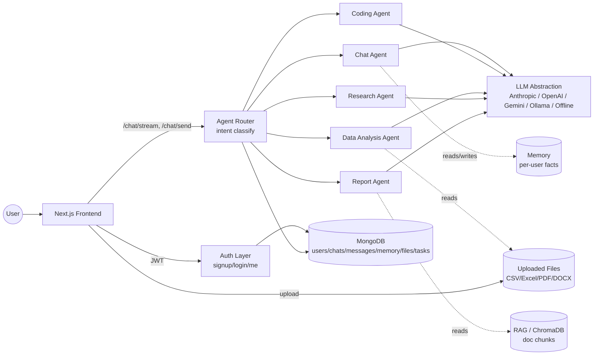

# OmniMind AI

One AI that can do almost everything. A full-stack GenAI + multi-agent
platform: chat, document RAG, web research, code generation, data
analysis, and long-term memory, behind a single JWT-authenticated API.

This repo is the **MVP scaffold**: every layer in the architecture is
wired end-to-end and runnable with **zero API keys** via a deterministic
offline LLM fallback. Adding a real provider key upgrades responses
transparently — no code changes required.

## Architecture



Every routing decision is logged into a `trail` array returned with each
response (and streamed as a `routing` SSE event) — the frontend shows
which agent answered, so the router is never a black box.

## Repo layout

```
backend/
  app/
    auth/         signup, login, JWT, per-user isolation dependency
    llm/          provider abstraction + offline fallback
    agents/       router + 5 specialized agents
    chat/         chat routes (SSE streaming), file upload routes
    memory/       long-term memory CRUD + retrieval
    db/           Mongo connection + collection helpers
    config.py     env-driven settings
    main.py       FastAPI app, CORS, router wiring
frontend/
  app/
    login/        signup/login screen
    chat/         streaming chat UI with agent badges, file upload
  lib/api.ts       typed fetch client + SSE stream parser
docker-compose.yml one-command local run (mongo, redis, backend, frontend)
```

## Running locally

### Option A — Docker (fastest)

```bash
cp backend/.env.example backend/.env
docker compose up --build
```

Frontend: http://localhost:3000　·　Backend: http://localhost:8000/health

### Option B — manual

```bash
# Backend
cd backend
python -m venv venv && source venv/bin/activate
pip install -r requirements.txt
cp .env.example .env          # edit if you have API keys; blank = offline mode
uvicorn app.main:app --reload

# Frontend (new terminal)
cd frontend
npm install
cp .env.local.example .env.local
npm run dev
```

You need a local MongoDB running (`mongod` or `docker run -p 27017:27017 mongo:7`)
for either option. Redis is only needed once background jobs (large-file
ingestion, long report generation) are wired in — the MVP works without it.

### Zero-key demo

Leave every `*_API_KEY` in `backend/.env` blank. Sign up, chat — the
offline provider replies deterministically, and the router, auth, memory
CRUD, and file upload all work fully. This is intentional: it's the
"runs end-to-end with zero configured API keys" constraint, not a
degraded demo.

## What's implemented (MVP)

- **Auth**: signup/login/me, bcrypt hashing, JWT, per-user isolation
  enforced via a single `get_current_user` dependency every protected
  route uses.
- **LLM abstraction**: one interface, four real providers (Anthropic,
  OpenAI, Gemini, Ollama) + offline fallback, auto-selected by which
  key is set, or forced via `OMNIMIND_FORCE_PROVIDER`.
- **Agent router**: keyword-heuristic intent classifier → 5 agents
  (chat, coding, data-analysis, research, report-writing). Routing
  trail is returned/streamed to the frontend.
- **Chat**: SSE streaming (`/chat/stream`) with real token streaming for
  the chat agent, message history persisted per chat per user.
- **Memory**: per-user fact storage, keyword-overlap retrieval injected
  into the chat agent's system prompt, full CRUD via `/memory` so users
  can view/edit/delete what's remembered.
- **Files**: upload/list/delete with per-user storage; CSV/Excel are
  immediately usable by the data-analysis agent (pandas summary → LLM).
- **Frontend**: login/signup, streaming chat with live agent badges,
  file upload, logout. Talks to the API via a typed client with a
  hand-rolled SSE parser (no extra deps).

## Roadmap (stretch features, not yet built)

These are deliberately deferred so the MVP stays small and demoable —
each is additive, not a rewrite:

1. **Real RAG ingestion** — `files_routes.py` already marks non-tabular
   uploads `pending_ingestion`; wire PDF/DOCX text extraction → chunking
   → ChromaDB embedding → have `report_agent`/`chat_agent` retrieve
   top-k chunks and cite `source documents` (the `sources` field is
   already in every API response, just empty until this lands).
2. **LangGraph-based router** — swap `classify_intent`'s keyword rules
   for an LLM-based classifier node, without touching the `AgentResult`
   interface agents already return.
3. **Background jobs (Redis/RQ or Celery)** — long report generation and
   large-file ingestion currently run inline; move them to a queue once
   they're slow enough to need it.
4. **Tool calling inside agents** — coding agent running code in a
   sandbox, research agent doing multi-hop search, data agent generating
   actual chart images (matplotlib) instead of text-only stats.
5. **Voice & vision** — Whisper for voice input, a vision-capable
   provider path for image uploads.
6. **Real-time task planning** — the `tasks` Mongo collection and
   frontend "Task/plan view" are scoped but not yet built; natural next
   agent to add once the other five are solid.
7. **Frontend polish** — file manager RAG-status view, memory
   viewer/editor UI (backend CRUD already exists), per-chat titles
   generated by the LLM instead of "New chat".

## Why this shape

This project doubles as a full-stack GenAI + agentic + ML showcase: JWT
auth and per-user isolation demonstrate backend fundamentals; the
provider-agnostic LLM layer and offline fallback show you understand
production LLM apps don't hard-code one vendor; the multi-agent router
with a visible trail shows agentic system design without hiding the
mechanism; and RAG + memory (once #1 above lands) round out the "GenAI
platform" story end to end.
